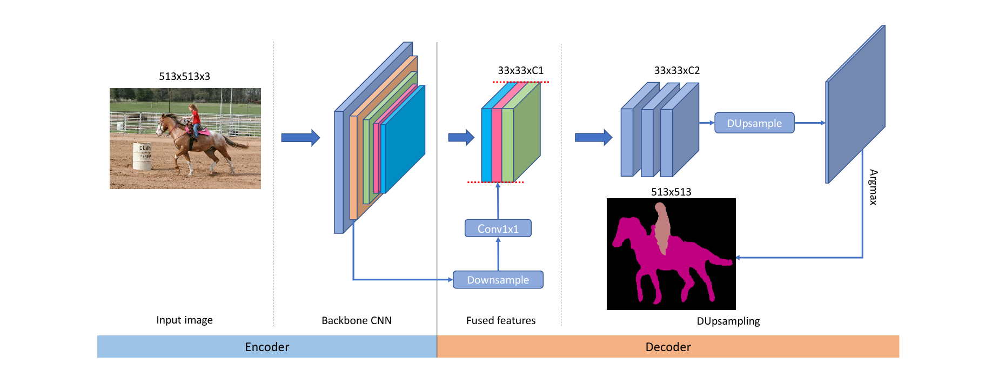

# Decoders Matter for Semantic Segmentation : Data-Dependent Decoding Enables Flexible Feature Aggregation

### 这篇笔记的写作者是[VisualDust](https://github.com/visualDust)。

这是一篇关于数据依赖型解码器的理论和测试工作的论文。

近年来，常见的语义分割方法利用编码器-解码器结构进行逐像素的预测任务。在这些解码器每一层的最后通常是一层双线性上采样的过程，用于将像素恢复至原有像素大小。本论文的研究表明，这种与数据无关的双线性上采样方法可能会导致结果并不完美。

所以，本论文提出了一种依赖于输入数据的上采样取代双线性上采样，称为“DUpsampling”。这个新的方法利用在语义分段标签中的空间冗余，能够从低分辨率的CNN输出中恢复分辨率并实现逐像素预测。该方法在分辨率相对较低的输入上能获得更加精确的分割效果，并且显著降低了计算的复杂度。也就是说：

- 这种新的上采样层重建能力非常强
- 这种方法对任何CNN编码器的组合和使用表现出很好的兼容性

本论文还通过实验标明了，DUpsampling性能优越，并且无需任何后处理。

> Recent semantic segmentation methods exploit encoder-decoder architectures to produce the desired pixel-wise segmentation prediction. The last layer of the decoders is typically a bilinear upsampling procedure to recover the final pixel-wise prediction. We empirically show that this oversimple and data-independent bilinear upsampling may lead to sub-optimal results. 
> In this work, we propose a data-dependent upsampling (DUpsampling) to replace bilinear, which takes advantages of the redundancy in the label space of semantic segmentation and is able to recover the pixel-wise prediction from low-resolution outputs of CNNs. The main advantage of the new upsampling layer lies in that with a relatively lower-resolution feature map such as 1/16 or 1/32 of the input size, we can achieve even better segmentation accuracy, significantly reducing computation complexity. This is made possible by 1) the new upsampling layer's much improved reconstruction capability; and more importantly 2) the DUpsampling based decoder's flexibility in leveraging almost arbitrary combinations of the CNN encoders' features. Experiments demonstrate that our proposed decoder outperforms the state-of-the-art decoder, with only 20% of computation. Finally, without any post-processing, the framework equipped with our proposed decoder achieves new state-of-the-art performance on two datasets: 88.1% mIOU on PASCAL VOC with 30% computation of the previously best model; and 52.5% mIOU on PASCAL Context.     

如果有时间的话请阅读[原作](/papers/Decoders-Matter-for-Semantic-Segmentation-Data-Dependent-Decoding-Enables-Flexible-Feature-Aggregation.pdf)。本文只是对原作阅读的粗浅笔记。

---

## Introduction（介绍）

现阶段，基于FCN的稠密预测方法在语义分割领域内取得了巨大的成功，事实证明，CNN组成的编码器的特征提取功能非常强大。很重要的一点是，卷积运算所具有的参数共享特性让训练和预测变得高效（卷积运算的一些特性可以参考[这篇文章](../ch2p1/<1>convolutional-nn-and-ops.md)）。

在原始的FCN方法中，编码器在提取高级特征的过程中往往会导致原图的分辨率被降低很多倍，从而导致精细的像素空间信息部分丢失，这使在原图分辨率上的预测（尤其是在对象边界上的预测）往往不够准确。DeepLab中引入了空洞卷积（空洞卷积的大致概念可以参考[这篇文章](./<1>The-Devil-is-in-the-Decoder-Classification-Regression-and-GANs.md)中关于空洞卷积方法的部分）实现了在不降低原图大小的情况下扩大感受野（接收场）的效果。

上图是一个在DeepLabv3+中使用的典型的Encoder-Decoder（编码器-解码器）结构。这个结构的编码器对输入进行了下采样比例为4的下采样后输入到解码器，并在最终的多特征图合并前对编码器产生的高阶特征进行了上采样，最后，使用双线性插值上采样完全恢复分辨率。在这个过程中，编码器是由CNN表示的，其任务是在原图上提取出不同级别的特征；解码器是由很多上采样表示的，其任务是将编码器产生的特征恢复到原图大小。

在以前的成果中，解码器通常由几个卷积层和双线性上采样层构成，这些层的主要目标是恢复被CNN忽略的细粒度信息。简单的双线性上采样方法对逐像素预测的恢复能力优先，它是一个机械的过程，不考虑每个像素预测之间的相关性，也就是说，它是独立于数据的过程。这就导致我们往往需要在双线性上采样之前的卷积解码器内就需要将CNN的产物产生为较高分辨率的特征图（通常至少恢复到原图大小的1/4或1/8），以便获得良好的预测结果。

这就产生了两个问题：

1. 为了让解码器输出更高一点分辨率的特征图作为双线性上采样的输入，需要空洞卷积大幅减小移动步幅，这导致训练和预测开销增大。例如，为了达到最好的分割效果，DeepLabv3中的编码器的下采样时步幅降低了4倍（从32降低到8），这就导致了DeepLabv3推理相对缓慢。
2. 为了达到更好地效果，解码器往往必须将编码器产生的特征上采样到更低的特征维度中进行融合，这也是双线性上采样的不足导致的。这个局限性限制了特征聚合结构设计的空间，因此很可能导致次优的特征组合在解码器中被聚合在一起。这篇论文在后面证明了如果能很好的设计聚合特征的部分而不受特征图分辨率的限制，可以找到更好的特征聚合策略。

为了解决双线性上采样的一系列问题，这篇论文提出了一种新的与数据相关的上采样方式，称为“DUpsampling”，该方法利用分割标签空间中旷阔的特征空间，在CNN构成的编码器输出的低分辨率特征图的恢复中有更好地兼容性，从而使卷积解码器的压力更小，也不需要编码器降低下采样率。

这种设计使融合特征的分辨率和最终预测输出的分辨率脱钩。这种结耦可以让解码器使用任意的特征进行聚合，从而设计出更好的特征聚合策略，更好地提高分割性能。

同时，**DUpsampling能够通过 1×1 卷积无缝拼接进任何卷积网络中**，因此并不需要任何额外的、特殊的设计的代码或是网络结构：

 上图是DUpsampling融合进编码器-解码器网络的的设计形式的一种描述。

## Approach（这篇论文的方法）

在这一部分，该论文首先用DUpsampling重新定义语义分割中的相关步骤；然后提出自适应的softmax函数，这使DUpsampling的训练变得更加容易；最后这篇论文展示了如何通过融合被下采样后的低级（？）特征来大大改善这个框架。

### 数据依赖型的上采样

#### 原有方法

令$Y\in {0,1,2,...,C}^{H \times W}$是数据集的ground truth标签map，其中$H$表示原图的高度，$W$表示原图的宽度，$C$表示分割数据集中的种类数量。

令$\hat{F} \in R^{\hat{H}\times \hat{W}\times \hat{C}}$是CNN组成的编码器的输出，其中$\hat{H}$表示输出特征图的高度，$\hat{W}$表示编码器输出特征图的宽度，$\hat{C}$表示编码器输出特征图的通道数量。经过下采样后，编码器输出的特征图的大小往往要比原图小很多。我们姑且认为$\frac{\hat{H}}{H} = \frac{\hat{W}}{W} = \frac{1}{16}$或$\frac{1}{32}$。

由于分割需要逐像素的预测，所以一般会将$\hat{F}$上采样到$Y$所在的空间大小后才能计算损失，所以我们令$F = bilinear(\hat{F})$表示双线性上采样后的$\hat{F}$。在典型的分割方法中，损失函数可以表示为：
$$
L(F, Y) = Loss(softmax(F), Y))
$$

#### 存在问题

是一种典型的交叉熵损失函数。但是这篇论文表双线性上采样太简单并且在特征图上采样重建的结果上表现得并不好，没有达到最佳。为了弥补双线性上采样的重建能力的不足，解码器不得不将CNN编码器产生的低分辨率特征图先上采样到一个较高的分辨率作为双线性上采样的输入。就像之前说的，可以使用空洞卷积解决这个问题，但同时也带来了更高的计算性能消耗。例如，在空洞卷积中将间隔步幅从16减小到8会导致超过3倍的性能消耗。

#### 提出方案

有一个值得注意的问题，就是标签$Y$并不是i.d.d（Independent and identically distributed，独立同分布）的，也就是说，Y内部包含了很多结构信息，也就是说，尝试压缩Y使其变为$\hat{Y} \in R^{\hat{H}\times \hat{W}\times \hat{C}}$，可能不会造成太大的损失。之前大家的思路都是将$\hat{F}$上采样到和$Y$一样大的$F$，然后做损失函数；而这篇论文尝试将$Y$下采样到和$\hat{F}$一样大的$\hat{Y}$，然后在$\hat{Y}和\hat{F}$之间计算损失函数。

为了将$Y$下采样为$\hat{Y}$，该论文设计了一种变换，目的是最小化将$Y$变为$\hat{Y}$的导致的重构误差。具体来说：

1. 令$r = \frac{\hat{H}}{H} = \frac{\hat{W}}{W}$（通常这个值是16或者32）；
2. 将$Y$划分为$\frac{r}{H}\times \frac{r}{W}$（如果不能整除，则填充到可以整除）大小的窗格，也就是有$r \times r$个子窗格；
3. 对于每个子窗格$S\in {0,1}^{r \times r \times C}$，我们将其reshape为$v \in {0,1}^N$，其中$N = r\times r\times C$；
4. 最后我们将$v$压缩为$x\in \R^{\hat{C}}$，然后将所有的X按照原有的垂直和水平顺序堆叠形成$\hat{Y}$。

虽然还有很多办法能实现这种压缩，但是这篇论文在实验中发现使用简单的线性投影即将$v$与另一个投影矩阵$P\in \R^{\hat{C}\times N}$相乘就能达到不错的效果。正式地说，就是：
$$
x = Pv; \hat{v} = Wx
$$
其中$P\in \R^{\hat{C}\times N}$是用来将$v$压缩为$x$的矩阵，$W \in \R^{N\times \hat{C}}$是一个逆投影矩阵，用于将$x$重建回$v$，而$v'$代表了重建后的$x$。在上述参数中这篇论文省去了很多偏移项。$P$和$W$可以通过在训练集上最小化$v$和$\hat{v}$的运算求得。

