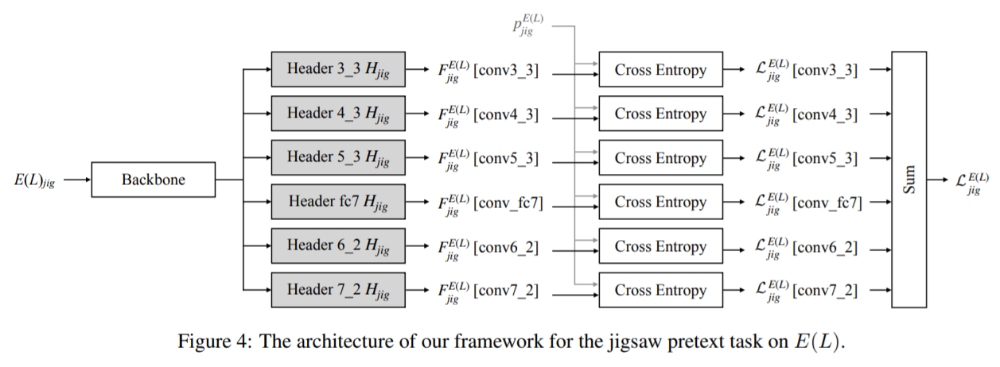

# HLA-Face Joint High-Low Adaptation for Low Light Face Detection

#### 这篇笔记的写作者是[PommesPeter](https://github.com/PommesPeter)。

这是一篇讲低光照人脸检测的论文。[原论文（HLA-Face Joint High-Low Adaptation for Low Light Face Detection）](/papers/HLA-Face-Joint-High-Low-Adaptation-for-Low-Light-Face-Detection.pdf)。

- 充分利用现有的正常光数据，并探索如何将面部探测器从正常光线调整到低光。这项任务的挑战是，正常和低光之间的差距对于像素级和物体级别来说太大而复杂。因此，大多数现有的lowlighenhance和适应方法不达到所需的performance。
- 本文是DARK FACE为基准，针对现有的正常照度图像，将图像调整成低照度图像，不需要标签
- 一个是像素级外观的差距，例如不足，照明，相机噪声和颜色偏置。另一个是正常和低光场景之间的物体级语义差异，包括但不限于路灯的存在，车辆前灯和广告板。传统的低光增强方法[5,6]设计用于提高视觉质量，因此不能填充语义差距，
- 通过使低光图像亮起并扭曲正常光图像，我们构建位于正常和低光之间的中间状态。

摘要:

> Face detection in low light scenarios is challenging but vital to many practical applications, e.g., surveillance video, autonomous driving at night. Most existing face detectors heavily rely on extensive annotations, while col- lecting data is time-consuming and laborious. To reduce the burden of building new datasets for low light condi- tions, we make full use of existing normal light data and explore how to adapt face detectors from normal light to low light. The challenge of this task is that the gap between normal and low light is too huge and complex for both pixel-level and object-level. Therefore, most existing low- light enhancement and adaptation methods do not achieve desirable performance. To address the issue, we propose a joint High-Low Adaptation (HLA) framework. Through a bidirectional low-level adaptation and multi-task high- level adaptation scheme, our HLA-Face outperforms state- of-the-art methods even without using dark face labels for training. Our project is publicly available at: [https: //daooshee.github.io/HLA-Face-Website/](https: //daooshee.github.io/HLA-Face-Website/)

## 问题

- 在不利照明条件下的面部检测仍然具有挑战性。在不足的图像捕获的图像遭受一系列降级，例如低可见性，密集噪声和彩色铸造。
- 现有的目标检测方案很少考虑到在低照度图像上的检测
- 监控视频分析和夜间自动驾驶中的潜在风险。
- 现有的图像增强增强之后还是检测不到
- 黑脸检测的问题是H和L之间的差距对于现有的处理方法来说太大并且复杂。
- 不同图像不仅只有像素级的不同，还有针对不同的场景和对象，但是增强和暗化图像只考虑像素级的差距
- 目前很多基于低照度的目标检测都需要依赖标签，限制了灵活性和鲁棒性

## 所做工作

### 相关工作

1. 提出了一种对于低照度增强的解决方案，对于暗处人脸检测
2. 提出了一种暗处人脸检测器不需要使用对于暗处人脸的标签(基于DSFD进行改进)
3. 提出了一种优秀的方法对于高低级的联合适应
4. 提出了高低级适应模式

### 总结

- 我们提出了一种框架，用于黑暗人脸检测检测，没有标签的黑暗人脸数据。通过联合低级和高级特征适应，与最先进的面部检测和适应方法相比，我们的模型实现了卓越的性能。
- 对于低级特征适应，我们设计了双向方案。通过使用噪音和颜色偏置的低光数据和扭曲常规光数据，我们设置中间状态，并使两个域每个域彼此迈向。
- 对于高级别特征的适应，我们引入了功能适应的跨领域自我监督学习。通过基于背景和对比学习，我们全面地关闭了多个域之间的特征距离，并进一步加强了表示。
- 我们通过组合低级和高级别的适应方法来提出一种优异的方法。

## 变量名

- $H$:正常照度图像

- $L$:低照度图像

- $E(.)$:用于将图像进行增强的网络

    E(.)的网络结构:

    

- $D(.)$:用于将图像暗化的网络

## 论文创新点

- 为了共同填补像素级和特征级别的黑暗人脸检测，我们提出了一种高低适应（HLA）方案。如图**Figure2**我们在L和H之间设置低级中间状态，并基于这些状态适应相应的高级表示。
- 增强和变暗都减少了low level distance。与l-to-h或h-to-l的单向翻译相比，我们的双向翻译：L-to-E(L)和H-to-D(H)，不仅可以缓解适应的难度，还提供更多的工具用于特征级适应。
- 通过向彼此推动多个状态的特征空间来减少high-level distance
- 通过对比度学习进一步增强了特征表示。

## 怎么做的？

### High-Low Adaptation模式

设置了一种中间状态在L和H之间，基于这些状态相互适应hign-level表示。通过低照度增强和暗化图像来缩短low-level之间的差距。与传统L-to-H和H-to-L单向转换相比，使用双向转换的模式，也就是L-to-E(L),H-to-D(H).通过把多种状态的特征空间合并到一起能减少hign-level的距离。再通过对比度学习能够增强特征。

### 双向Low-level适应

- 两方面问题

    1. Hign-level的间隙共存可以混淆像素级传输模型。这里是指对于征程图像生成低照度图像的时候像素点转移的时候位置不对。就是指对于高亮部分的像素在生成的时候现有的研究都生成到错误的位置，(高亮部分一般有路灯，车大灯等)现在的一些错误有人身体上生成了奇怪的光，生成路灯的亮度在人脸上。MUNIT能够分辨物体和背景，但是生成的图像不够黑，跟低照度图像相比差别很大。
    2. 对于低照度增强本身来说比较困难。现有的一些低照度增强方法都是按照人类视觉的方式进行增强，不是考虑机器视觉。现在错误有画出了暗区域的边缘，有噪声的部分还是黑的，增强的对比度可能会影响检测性能。此外，DF数据集上幂集的噪声和偏色，现有的去噪和颜色重构方法不足以解决这些问题。

- 解决方案

    * 提出了**双向低级特征适应模式**。正常图像低照度化是一个复杂的过程，可以分解成三个因素：亮度、噪声、色偏。所以对于$L$来说调整亮度变成$E(L)$,对于$H$来说用噪声和色偏形成$D(H)$.这样操作使得$E(L)$和$D(H)$更加相似。这样做降低了生成低照度图像和正常图像的困难。将特定的部分低照度，模型不会收到结构域之间的语义差距的干扰

        

        

        1. 增强——变亮:

            + 调整亮度的同时不会让图像产生噪声和色偏(调整亮度后不需要额外再去噪和颜色重构).有些低照度图像亮度不均匀，有一些脸会被路灯照亮有些可能是变黑。因此还要避免过曝光和曝光不足。所以使用了基于**非线性曲线映射**方法
                $$
                LE(x,A)=x+Ax(1-x);\\LE_n=LE(LE_{n-1};A_n);\\
                $$
                进行迭代。(变量说明:$LE_0$是输入图像,$LE_n$是迭代n次的结果,$A_n$是神经网络预测出来的调整图，是三通道的)曲线映射不会引入额外的噪声或者伪图像(为什么?)，使用了一个7层具有对称Skip-connection的CNN和相应的目标函数。

            + 针对增强，并没有进行很强烈的增强，只是一个弱增强，因为如果增强太多会导致噪声突出，隐藏噪声于黑暗之中，成像质量这样更好。对比较亮的区域进行强增强，用两倍的迭代基于上文的公式，扩大曲线估计网络，模型可以更亮的方式增强图像，但缺点是伴随而来的是噪声和色偏，但在$H-to-D(H)$中会进行处理。(文章里的illumination是指图像中某一块比较亮的区域)

        2. 噪声合成:

            + 像素级别上的噪声可以通过调整亮度减少，但是要减少$E(L)$和$H$之间的距离仍然比较困难。通过分离颜色来引导噪声合成的过程(为什么?)
            + 首先是进行一次双侧滤波器模糊,使用参数$d=25$和$σ=75$.模糊后的结果$E(L)_{blur}$作为颜色引导噪声合成。
            + 其次使用Pix2Pix进行训练，将模糊后的结果$E(L)_{blur}$转移到所需要的$E(L)$
            + 最后，对$H$也进行同样的操作进行添加噪声，最终得到的$H_{noise}$成功模仿了E(L)的噪声，颜色分布的差距在下一步进行处理。

        3. 颜色抖动(修正):

         + $D(H)$的颜色分布要匹配$E(L)$，基于统计学分析，我们设置了亮度抖动区间$(0.4,1.2)$,对比度抖动区间$(0.6,1.4)$,饱和度抖动区间$(0.6,1.4)$,色度抖动区间$(0.8,1.2)$ (为什么?)

    * 使用**多任务高级特征适应**，很多特征适应方法都是基于图像对齐、伪标签训练、对抗学习等，图像对齐和伪标签训练不能处理差距比较大的。对抗学习不稳定，我们使用图像的自然信息也就是图像本身，进行自监督学习。通过自监督分类器共享域，特征被强制映射到相同的高维子空间，因此使得靠近高级特征间隙。学习方案：

        

        自监督学习模块结构

        

        骨干网络:

        (采用DSFD的主干，VGG16提取出6层多尺度特征:conv3_3,conv4_3,conv5_3,conv_fc7,conv6_2,conv7_2)

        

        1. 使得$E(L)$与$H$靠近$(E(L)\lrarr H)$，基于上下文的自我监督学习设计目标，模型通过学习空间上的上下文信息。使用拼图方法能很好地完成上面的目标。将一个3x3的patch放到整个图像上，设这个patch排序数为30，相当于就是一个30分类问题,损失函数为
            $$
            L_{jig}^{E(L)}=L_c(F_{jig}^{E(L)},p_{jig}^{E(L)}) \\ L_{jig}^{H}=L_c(F_{jig}^{H},p_{jig}^{H}))
            $$
            (变量说明:$p_{jig}$表示排列的标签，$L_c$表示交叉熵损失函数,$F_{jig}$表示相应域中提取出来的特征(写在变量右上方表示对应域的下的值),E(L)和H共享一个强行把语义特征映射到相同空间的分类头，因此使得高级特征之间的间隙减少，最终损失函数:
            $$
            L_{E(L)\lrArr H}=L_{jig}^{E(L)}+L_{jig}^{H}
            $$
            以jigsaw方法的适应为例子的结构:（其他同理）

            ​	从刚才的主干中抽取出6层特征图，然后进行相应jigsaw操作.

            

        2. 使得$H$和$D(H)$靠近$(H\lrarr D(H))$，灵感来自于相对学习，在相对学习中，查询一个v,判断这个v是在正样本对还是负样本对，类似点乘的方法。目标函数
            $$
            L_q= -\log \frac{\sigma(v,v^+)}{\sigma(v,v^+)+\sum^N_{n=1}\sigma(v,v_n^-)},\sigma(x,y)=\exp(x\cdot y/\tau)
            $$
            (变量说明:$\tau$是温度超参数，这是一个$(N+1)$分类问题)

            为了减少$H$和$D(H)$之间的差距，我们发挥相对学习的优势，能够使得样本更加靠近正样本。做了一个H正样本对是来源于D(H)的。损失函数为:
            $$
            L_{H\Lrarr D(H)}=L_q(H,D(H)^+,H^-)+L_q(D(H),H^+,D(H)^-)
            $$
            用这种方式，H和D(H)之间的相似特征会被增强，高级特征间隙更小。在单域上的对比学习中，通过$D(.)$作为增强的一部分，简化上述损失:$L_{H\Lrarr D(H)}=L_q(D_i^*(H),D_j^*(H)^+,D_k^*(H)^-)$(变量说明:$D^*(H)$有50%的概率是$H$，另外50%的概率是$D(H)$,使用MoCo进行优化)

        3. 增强$E(L)$$(E(L)\uparrow)$，通过对比学习提高E(L),损失函数为:

        $$
        L_{E(L)\uparrow}=L_q(E(L),E(L)^+,E(L)^-)
        $$

        

    * 最终损失函数
        $$
        L=\lambda_{det}L_{det}+\lambda_{E(L)\lrarr H}L_{E(L)\lrarr H}+λ_{H↔D(H)}L_{H↔D(H)}+λ_{E(L)↑}L_{E(L)↑}
        $$
        (说明:$det$下标为检测的损失,$E(L)\lrarr H$为$E(L)$与$H$靠近的损失,$H↔D(H)$为$H$与$D(H)$靠近的损失,$E(L)↑$为增强$E(L)$的损失)

    ## 实验结果

    ### 与目前现有方法比较

    - 人脸检测

        

    - 增强效果

        

    - 暗化效果

        

    - 无监督域域适应

        无监督域适应是基于Faster-RCNN,但是表现很差，所以使用DSFD作为人脸检测器，使用不同方式进行增强的效果，进行消融实验。

        
