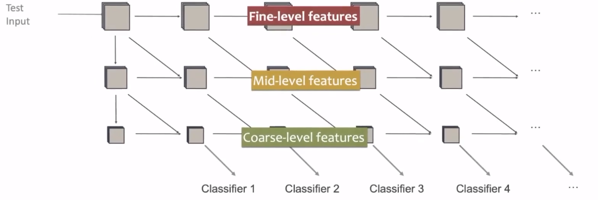
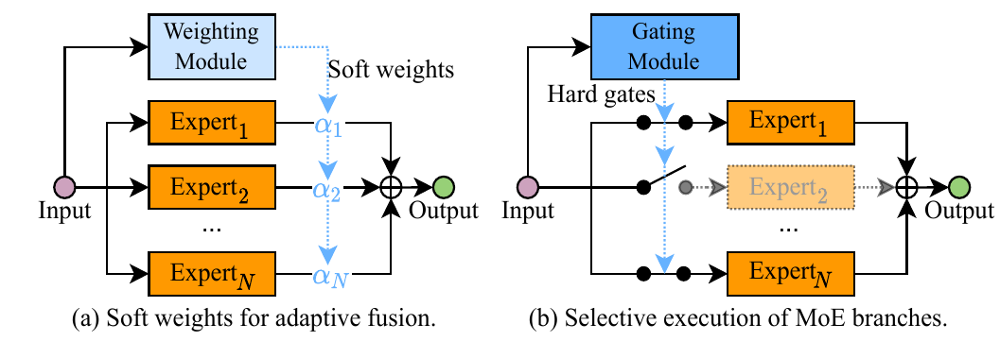
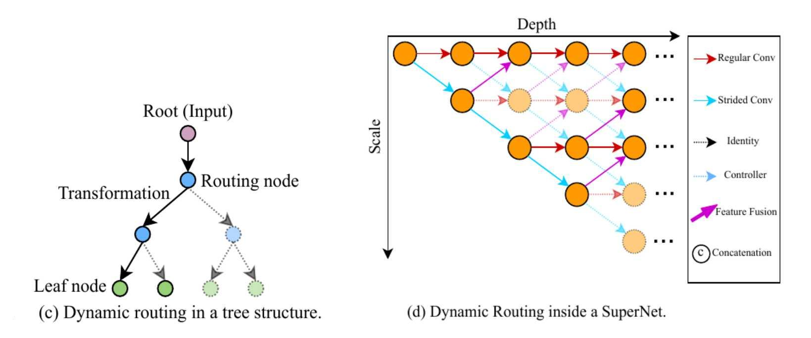
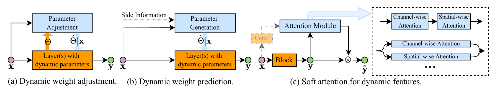
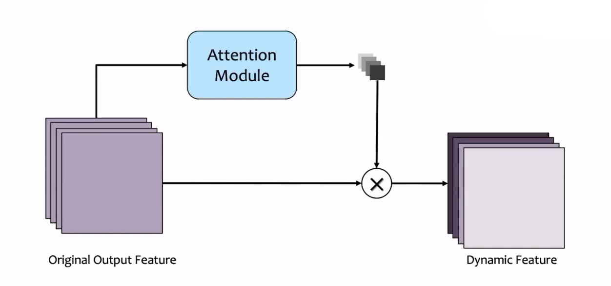
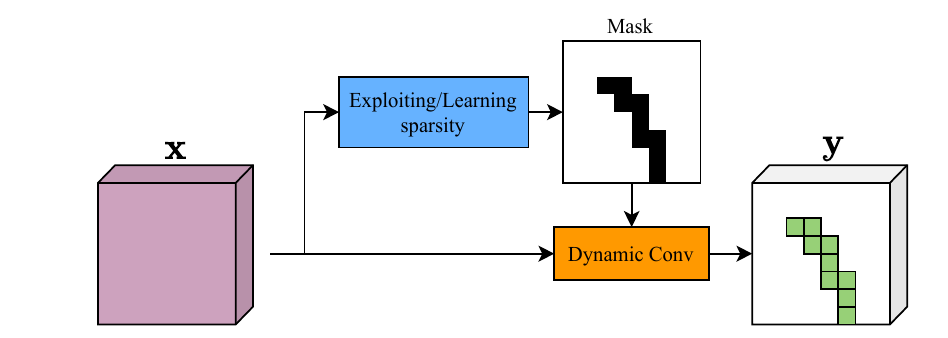
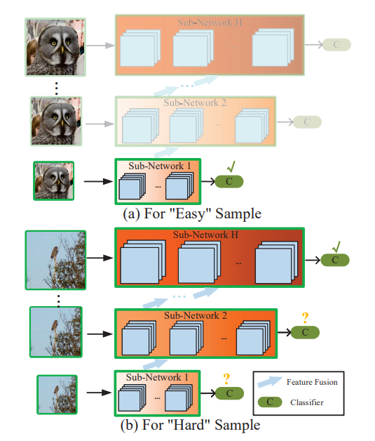

# Dynamic Neural Networks: A Survey

### 这篇笔记的写作者是[VisualDust](https://github.com/visualDust)。

这篇论文是一篇对动态神经网络的综述，原论文["Dynamic Neural Networks: A Survey"](http://arxiv.org/abs/2102.04906)主要讲了：

- 概念（Introduction）
- 常见的动态神经网络
  - Instance-wise Dynamic Networks
  - Spatial-wise Dynamic Networks
  - Temporal-wise Dynamic Network
- 推理和训练（Inference and Training）
- 常见应用和代表性工作（Applications）

这篇论文对近些年吸引了很多研究者的动态神经网络进行了较为系统的总结概括。

> Dynamic neural network is an emerging research topic in deep learning. Compared to static models which have fixed computational graphs and parameters at the inference stage, dynamic networks can adapt their structures or parameters to different inputs, leading to notable advantages in terms of accuracy, computational efficiency, adaptiveness, etc. In this survey, we comprehensively review this rapidly developing area by dividing dynamic networks into three main categories: 1) instance-wise dynamic models that process each instance with data-dependent architectures or parameters; 2) spatial-wise dynamic networks that conduct adaptive computation with respect to different spatial locations of image data and 3) temporal-wise dynamic models that perform adaptive inference along the temporal dimension for sequential data such as videos and texts. The important research problems of dynamic networks, e.g., architecture design, decision making scheme, optimization technique and applications, are reviewed systematically. Finally, we discuss the open problems in this field together with interesting future research directions.

动态神经网络近些年的相关研究逐渐变多，比起固定计算图的传统的静态神经网络，动态神经网络能够可以根据输入的具体数据调整它们的结构或是参数，同时在速度和精度方面占有优势。一种比喻是：“在输入较为简单时，动态神经网络可以很快；在输入较为复杂时，动态神经网络可以精度很高”。

这篇论文概括地介绍了动态神经网络是如何“动态”的，以及动态带来了怎样的优势。 

我看了这篇综述受益匪浅，如果有时间的话请阅读[原作](http://arxiv.org/abs/2102.04906)。本文只是对原作阅读的粗浅笔记。

---

## 介绍（Introduction）

神经网络随着硬件条件的发展逐渐追求更好的效果和更高的性能。作者将视觉领域的神经网络近十年的发展分为这样几个阶段：

1. 快速发展阶段（Fast developing stage），2012~2015

   神经网络的设计变得多样化，出现了包括AlexNet、VGG、GoogLeNet在内的一系列代表性网络结构。

2. 发展成熟阶段（Mature stage），2015~2017

   这个阶段出现了很多至今都起到了很重要的影响的或是依然被大家经常使用的网络结构，例如ResNet、DenseNet等

3. 繁荣发展阶段（Properous stage），2017~Now

   人们设计了很多多样化的效果优秀的神经网络，并且大量出现了很多新型的神经网络，例如轻量级网络CondenseNet、ShuffleNet，利用自动搜索技术设计的模型NASNet、DARTS，还有这篇论文想要介绍的动态神经网络MSDNet、Block-Drop、Glance and Focus等，以及突然就火起来的Transformer。

直到现在，CNN structure  has been never more varied。以CNN网络为例，CNN在ImageNet上的分类准确率正在逐渐提高，甚至达到超过人类的分类水平。随着模型的准确率逐渐提升，人们提出了这样的问题：

> 如何平衡网络的精度和网络计算开销之间的关系

上面这张图片来自一篇名为[Speed/accuracy trade-offs for modern convolutional object detectors](https://arxiv.org/abs/1611.10012)的论文，大致描述了一些知名网络结构的`开销-精度`图。这便是在神经网络成熟之后人们开始关注的问题。人们希望有更加靠近左上角的模型。

一个既成事实是，模型的精度往往和模型的宽度和深度相关，当希望达到更高的准确率时，往往会增加模型的深度和宽度，但是这往往会提高神经网络计算的开销，也就是说此时模型会走向模型的右上角。

以上面的图片为例，左图是一只的[coronaPolvo](https://github.com/coronaPolvo)，右图是一只[PommesPeter](https://github.com/pommespeter)。他们都是我的好朋友，但是我一瞬间即可认出左图，而认出右图则需要几秒钟。这是因为左图画面明亮，且coronaPolvo占据了画面的主体位置；而右侧的PommesPeter并没有占据画面的主体，并且被车的阴影遮挡，光照条件较差难易辨认。

有很多研究已经标明了人的大脑在处理信息时的处理过程会受到周围环境以及很多其他上下文的影响。**这便是动态神经网路的基本构想：对于简单的样本，可以轻易认出；对于复杂的样本，可以多花一点时间。或者说，人名为能发现传统CNN的一个缺陷**：

> Most convolutional neural networks recognize all instance with the same architecture.

所以动态神经网络的能力就是：

> Dynamic neural networks can adapt their architecture for different instances.

动态神经网络具有以下优势：

- 高效（Efficiency）
- 更强的表达能力（Representation power）
- 更强的适应性（Adaptiveness）
- 兼容性（Compatibility）
- 设计的简单性（Generality）
- 设计的可解释性（Interpretability）

下图是这篇论文的整体内容，涵盖非常的广，推荐阅读一下[原文](http://arxiv.org/abs/2102.04906)。

---

## 样本自适应的动态神经网络（Instance-wise dynamic networks）

为了在简单样本上获得更快的推理速度，以及在复杂样本上获得更好的精度，一个最简单并且天真的思路就是，导入多个网络模型，并且在输入较为复杂时使用更复杂的网络，输入简单时使用简单的网络。这个方法基本行不通，因为网络无法提前知道一个输入到底是复杂的还是简单的。

所以，我们需要研究样本自适应的动态神经网络

> Instance-wise dynamic networks can adapt their architectures or parameters to each instance.

对不同的输入样本，这种网络会动态调节自己的结构或参数。

 这篇论文将样本自适应的动态网络分为：

- 动态结构（Dynamic architecture）
  - 动态深度（Dynamic Depth）
    - 早退机制（Early Existing）
    - 跳层机制（Layer Skipping）
  - 动态宽度（Dynamic Width）
    - 跳过神经元（Skip Neurons）
    - 跳过通道（Skip Channels）
    - 跳过分支（Skip Branches）
  - 动态路由（Dynamic Routing）
- 动态参数
  - 动态参数加权（Attention on weight）
  - 动态卷积核形状（Kernel shape adaptation）

---

### 动态结构（Dynamic Architecture）

#### 动态深度（Dynamic Depth）

##### 早退机制（early escape）

简而言之，动态深度就是网络会根据某种机制判定样本是简单的还算复杂的，对于难一点的样本，网络可以将其一算到底，而对于简单一些的样本，网络计算到中间的时候就可以停止计算了。

有两种常见的实现方式：

- (a)串联多个模型（Cascading of DNNS，比较早期的工作）

  在这种方法中，一个网络包含了由浅到深的多个模型：输入通过某个模型后得到输出，经过训练得到的“决定函数”会根据输出的具体情况决定是将特征图直接放入线性分类器还是再次输入到下个模型中继续推理。

  这种方法有一个问题，很多情况下，特征并不能被复用，或者说不同模型并不能很好地“级联”在一起，例如上图中(a)，若$Model_1$是VGG，而$Model_2$是ResNet，那么很明显这样的设计会导$Model_1$的输出并不能能作为$Model_2$的输入，从而演化成花费两个网络的计算开销，导致额外的性能浪费。

-  (b)添加中间出口（Network with intermediate classifiers）

  如上图中(b)，这种方法往往通过在一个骨干网络的每个模块之后插入出口实现，即在每个模块的后方加入一个出口，通过设计不同的退出准则来决定模型每经过一个模块的计算之后是否已经不再需要后续网络了，从而实现早退。

然而，这种使用早退的方法并不是最优的。有研究标明，如果在模型中添加中间出口，往往会影响模型的分类性能。原因是CNN的更深层输出的feature map往往才具有更多的语义信息，提前退出往往会导致特征提取“并不到位”。

比较简单的一种解决方法是使用多尺度的、密集连接的网络架构：

在上图中，较低维度的特征通过`concat`等操作融合到深层的特征中参与分类，这样不同尺度的特征都能够参与分类。其是否退出的标准为某个分类器的置信度是否达到某个阈值。

例如，在上图中，一张猫的照片参与了分类，当网络在某个分类器上的输出（一般是`softmax`输出）的置信度达到一定值的时候，网络就可以退出了，后面的网络将不被执行。从而实现了动态减小网络的计算量。

还有许多具有早退机制的网络，如果我看到了会单独写一节来介绍。

##### 跨层连接（skip connections）

早退机制是通过在网络执行的某个阶段退出从而节省计算开销的，而跨层连接的动态神经网络则会执行完整个网络，只是在网络的中间层会出现跨层的连接方式。跨层连接一般被实现在一些具有类似于`skip connection`或是`residual connection`的网络结构中。

跨层连接的一种简单实现方法是在具有跨层连接的网络中加入`Gating module`。如上图，经过训练的`Gating module`如果输出为1，则不跳过这一层；

当`Gating module`的输出为0时，就跳过这一层的计算，即输入直接被当作输出。`Gating module`一般是包含一个被称为门控函数（Gating function）的计算单元。

还有一种实现跳层的方法：

如上图，输入在正式进入主干网络之前会先经过一个被称为`Policy Network`的网络，这个网络会决定对于当前输入应该跳过哪些层，并通知主干网络这样做。`Policy Network`的输出一般是一个向量，其中包含了哪些层应该被跳过的信息。

还有许多具有跳层机制的网络，如果我看到了会单独写一节来介绍。

#### 动态宽度（Dynamic Width）

##### 动态通道数（Dynamic channel pruning in CNNs）

动态宽度的动态神经网络，顾名思义，这种网络会根据输入动态调整网络的宽度。一种比较简单的思路是，动态调整通道数量：

在上图中，也出现了一个被称为`Gating module`的模块，它根据输入的不同会向卷积层提供一个向量，该向量决定了卷积层跳过输出哪些通道。一种可能的方法是，该向量由0和1组成，卷积层将保留1代表的通道，而取消0代表的通道。

另一种可行的方法是使用多个不同宽度的网络对输入进行处理，当某个深度的网络的输出（例如`softmax`输出）达到某个阈值时，就不再加深网络了。

##### 专家子网络加权（Mixture of Experts，MOE）

这种方法是通过将很多不同的网络的结果进行动态加权来提升网络性能的一种方法。

上图是两种可行的思路：

- (a)是一种“软加权”，对多个网络的输出进行动态加权，每个子网络都会被执行完，通过调节加权达到更好的性能。
- (b)是一种“硬加权”，通过一个`Gating Module`决定某个子网络是否参与决策。如果某个子网络不参与决策，则它根本不会被执行。

请注意，这种方法会加大计算量和参数量。在后面的动态参数方法中，会介绍一种和该方法思路很类似的方法。

##### 动态全连接层大小（Dynamic width of fully-connected layers）

自如起名，动态修改全连接层的大小，不需要任何额外模块和设计。这里不做详细介绍。

---

#### 动态路由（Dynamic Routing）

上面介绍的动态深度和动态宽度的方法广义上实际上都能视为某种简单的动态路由方法。这里的动态路由单独拿出来，指具有更加复杂的超网络结构（超网络不再是简单地链式结构）的动态路由，这种结构甚至会给不同的样本以不同的计算图。

这里有两个可能的设计：

- (c)是一种树状结构
- (d)是一种多尺度的动态结构

---

### 动态参数（Dynamic Parameters）

动态参数指的是网络会根据输入的不同使用不同的参数对输入进行运算。可能的动态参数方法有：

- (a)使用一个动态参数加权调节（Parameter Adjustment）模块，根据输入产生一个影响运算参数的参数。
- (b)使用一个动态参数产生（Parameter Generation）模块，根据输入的不同产生不同的参数比如新的卷积核，对输入进行运算。
- (c)软注意力（Soft attention）方法

#### 动态参数加权（Attention on weight）

动态参数的设计能够提升模型的表达能力。下面举一个简单地例子进行说明：

在上图中`+`表示加和，$\alpha_1$、$\alpha_2$、$\alpha_3$分别表示一个动态参数调节模块产生的权重。根据输入的不同，这三个提前设定的卷积核通过不同的权重加权形成新的卷积核。上图中的这种操作等效于：

输入分别与三个不同的卷积核进行运算，并且通过$\alpha_1$、$\alpha_2$、$\alpha_3$三个权重加权形成输出。这种设计让人不禁想到在动态结构的设计中出现的专家子网络加权（Mixture of Experts，MOE）方法。不过之前的专家子网络加权方法在这种情形下要卷积三次，而动态参数加权的设计只卷积一次。

上面这两种等效的表达可以写为下列等式：
$$
(\sum_{n}a_n w_n)\cdot x = \sum_{n}a_n(w_n\cdot x)
$$

#### 动态卷积核形状（Kernel shape adaptation）

动态卷积核形状的方法能根据输入的不同调节卷积核的形状，以此来获得不同的感受野。比较著名的相关工作是一篇叫做Deformable Convolutional Networks（可形变卷积网络）的论文。

上图是论文Deformable Convolutional Networks中的示意图。

#### 动态参数和注意力的关系（Dynamic features or Dynamic weights）

有一个很好的问题：

> The goal of dynamic parameters is generating dynamic features. So why not rescale features directly with attention?

注意力机制也是为了动态产生特征的，为什么还要有动态参数的方法呢？例如，在较为出名的transformer中，是通过key和query的相似度对value进行动态调节；还有SENet（[Squeeze-and-excitation networks](https://arxiv.org/abs/1709.01507)）中，对不同通道进行的动态调节。

上图是SENet中提及的方法，输入经过正常的卷积运算产生一些channel，同时一个注意力模块（Attention Module）接收输入并产生一个注意力向量，作用于卷积产生的这些channel，使它们被乘以不同的权值。这种方法被称作通道注意力（Channel-wise attention）。

所以在某些角度上我们可以说：
$$
DynamicFeatures = DynamicWeight
$$
表示为公式就是：
$$
(x\times W)\otimes \alpha  =  x\times(W\otimes \alpha)\\
$$
其中，符号$\otimes$是克罗内克积，可以查阅相关资料进行了解。

上述公式中，等号左侧是动态卷积，先使用$W$对输入的$x$完成卷积，再乘上参数$\alpha$；等号右侧是动态参数，先使用参数$\alpha$影响卷积参数$w$，再对输入的$x$进行卷积。它们在数学上是等价的。

---

## 空间自适应的动态神经网络（Spatial-wise dynamic networks）

传统的卷积神经网络存在一个问题：

> Most conventional networks perform the same computation across different spatial locations of an image.

对于一张图片，在不同位置包含的信息量可能是不一样的。所以传统网络对图像中每个不同的位置使用相同的运算方法听上去会带来很多冗余的计算量。

在这篇论文中，作者将空间自适应方法大致分：

- 像素级（Pixel Level）
  - 动态结构（Dynamic Architecture）
  - 动态参数（Dynamic Parameter）
- 区域级（Region Level）
  - 动态变换（Dynamic Transformation）
  - 硬注意力（Hard Attention）
- 分辨率级（Resolution Level）
  - 自适应缩放率（Adaptive Scaling Ratios）
  - 多尺度架构（Multi-scalue Architecture）

#### 像素级自适应（Pixel Level）

像素级的一种代表工作如下：

在上图中，对于输入，经过一个轻量化的计算得到一个Mask代表哪些位置是重要的。根据生成的Mask进行一个稀疏的卷积，并得到一个稀疏的输出。对于没有被Mask覆盖的区域，可能通过Skip Connection等方式直接跳过运算，直接得到输出。

#### 区域级自适应（Region-Level）

区域级空间自适应方法的一种可行的方法是：

将图片输入到一个选择器中，选择器选出其中比较重要的一部分（抠出一个小Patch），并只将这一部分输入进网络或运算模块。

上图是一篇名为[Glance and Focus: a Dynamic Approach to Reducing Spatial Redundancy in Image Classification](https://arxiv.org/abs/2010.05300)的相关论文中的一个示意图。对于较为简单的样本，在一个小分辨率上直接得到可信的预测；对于复杂的样本，在网络得到置信度很高的输出之前，不断从图片中选择“较为重要”的一部分继续推测。

这种方法除了实现了一种注意力机制之外，还实现了网络的早退。

#### 分辨率级自适应（Resolution-Level）

分辨率自适应也是一种基于早退的方法，其基本构想是使用递进的网络深度处理不同分辨率的输入。

上图截取自相关工作RANet（[Resolution Adaptive Networks for Efficient Inference](https://arxiv.org/abs/2003.07326)），对于简单的输入，使用一个很小的子网络，若达到很好的置信度输出，则早退；对于复杂的输入，使用更深的网络进行推断。

上图是RANet的一种推断过程。图中各层`Conv Block`之间的蓝色箭头实现了特征复用。

## 时间自适应（Temporal-wise dynamic network）

对于序列的输入，例如视频或文本的输入，可以使用时间自适应的动态网络结构。

这篇论文将时间自适应的网络分为：

- 用于处理文本（Text）
  - 动态更新隐藏态（Dynamic Update of Hidden States）
  - 时间早退（Temporally Early Exiting）
  - 动态跳跃（Dynamic Jumping）
- 用于处理视频（Video）
  - 动态循环神经网络（Dynamic RNNs）
    - 动态更新隐藏态（Dynamic Update of Hidden States）
    - 时间早退（Temporally Early Exiting）
    - 动态跳跃（Dynamic Jumping）
  - 帧采样（Frame Sampling）

上图是常见的时间自适应的设计。 其中：

- (a)中的`Agent`接受时间戳为$t$的输入$x_t$，并判断该输入是否重要。若重要，则保留输入进网络并获得当前时间戳输出$h_t$；若不重要，则直接将上一个时间戳$h_{t-1}$作为输出，不进行任何计算。
- (b)中通过更窄一点的RNN模块进行更新，对于$h_{t-1}$和$h_t$中下半部分灰色的部分也是直接copy的。
- (d)的基本思路是采样输入中较为重要的位置，具体来说就是通过自适应让`RNN`模块跳过一些输入。

---

## 训练和推理

### 推理（Inference）

#### 基于置信度（Based on confidence）

早退机制的常用方法。当网络在某个阶段输出的`softmax`置信度达到某个阈值时网络就会退出。该方法不需要特殊的运算和设计，仅需要设计一个阈值。

#### 基于政策网络（Based on Policy Networks）

该方法在跳层实现的动态神经网络中常见。这种`Policy Network`的设计往往是基于主干网络的结构的，比如其输出的长度可能等于主干网络的`Block`总数，因此需要专门设计，并不是很通用。

#### 基于门控函数（Based on Gating Functions）

这种方法在很多动态神经网络中常见。通常`Gating Function`的职责可能是：

- 决定哪些网络层被跳过
- 决定哪些专家网络（Expert Network）被执行
- 决定哪些通道（Channel）被忽略
- 决定图像中的哪些区域被采样和卷积的

`Gating Function`的计算量通常较小，并且设计上具有即插即用的特点，更加常用。但是这类方法也有一个缺点，就是更长的训练过程。

---

### 训练（Training）

#### 训练目标（Objectives）

##### 早退网络的目标函数（Multi-exit Networks）

一种比较普通的思路是：
$$
L(y,f(x;\theta)) = \sum_{i}\lambda_i CE(y,f_i(x;\theta_i))
$$
其中，$CE$是交叉熵损失函数，$\lambda_i$是第$i$个退出位置的权值。有的工作中甚至$\lambda_i$设置恒等于1。也有更加复杂的用于提升多个不同分类器组合训练效果的目标：
$$
L_i = \alpha CE_i + (1-\alpha)KLD_i\\
KLD_i = -\sum_{c\in Y}p_k(c|x;\theta ,T)\log\frac{p_i(c|x;\theta ,T)}{p_k(c|x;\theta ,T)}
$$

##### 鼓励稀疏度的目标函数（Training Objectives for Encouraging Sparsity）

这类目标函数主要是为了训练跳层或是忽略通道的动态神经网络而设计的。通常情况下，这类网络需要动态调用网络中不同的模块。如果不单独设计新的目标函数，可能会导致网络陷入“尽可能多地调用网络的模块”或是“网络中某个模块一次也没有被调用”。因此很多工作加入了一种称为鼓励稀疏度的目标函数：
$$
L = L_{task} + L_{sparse}
$$
其中，$L_{sparse}$可以但不限于表示：

- 被激活或是被调用的网络模块的比率。很明显的是，当网络试图“尽可能使用全部模块”时，目标函数的值会增大。

- 动态调用的模型的复杂度，可以是计算量或是参数量的估算值（FLOPs）。

#### 优化方法（Optimization）

#####  梯度估计（Gradient Estimation）

一种可行的方法是使用`Gumbel-Softmax`对离散变量再参数化，这种方法主要用于优化`Gating Function`，使其嫩能构成完整的端到端训练系统。坏消息就是这种方法又引入了一个称为`Gumbel Noise`的随机变量，需要更长的训练过程，并且容易对某些超参数敏感。

##### 强化学习（Reinforcement Learning）

强化学习已经被应用于很多决策任务中。强化学习在动态神经网络中主要用于决定跳层、决定选择哪些Patch以及决定采样哪些帧。

---

## Whatever Disscussion

动态神经网络已经被应用于很多领域中（如上表）。

最后，这篇论文还对一些开放性问题进行了讨论：

- 动态神经网络理论（Theories）

  例如在多出口的网络里，早退机制的判断标准的阈值决策方法是没有很好的理论支撑的。因此，研究具有理论保障的动态决策方法也许可以进一步提升网络性能。

- 结构设计（Architecture Design）

  多尺度的动态网络结构设计说明了特别的网络设计对于提升网络的效率是有很大帮助的：在链式的结构中，浅层的feature并不能很好的被用来分类，而使用多尺度的设计就能让分类器达到更好地效果。

- 在不同任务上的可用性（Applicability on more diverse tasks）

  当前的很多动态神经网络都是为了分类任务而设计的。虽然很多思想（例如早退和跳层）理论上可以被应用于其他任务，但是大多数现存的动态网络设计并不能像ResNet、DenseNet一样被作为一个比较通用的主干网络，用于很多下游的任务。

- 理论和实际的差距（Gap between theoretical & practical efficiency）

  现在的一些动态神经网络受限于计算机硬件或是软件库的设计，并不能达到理论上的最优效果，比如上文中提到的一些空间自适应的设计，当前的图形处理器（GPU）及其运算库的设计对静态神经网络以及整张图片的卷积采样运算优化已经很好了，使用这种设计反而需要单独进行特殊设计。一个重要的议题是如何设计出在当前硬件条件下所带来的运算效率提升。

- 鲁棒性（Robustness）

  已经有工作研究了多出口网络在对抗攻击方面的鲁棒性，也有一个很有意思的网络，不但对网络的准确性发起攻击，还对网络的效率发起攻击，这也是一个研究方向。

- 可解释性（Interpretability）

  动态神经网络在时间和空间上的硬注意力机制和人的神经系统决策过程也是非常相似的。我们在看一张图片的时候也可能是先粗略地看一眼，然后再单独去看每个小Patch；人在看视频的时候也可能只需要看一些帧就能大概Get到这个视频在讲述什么。

