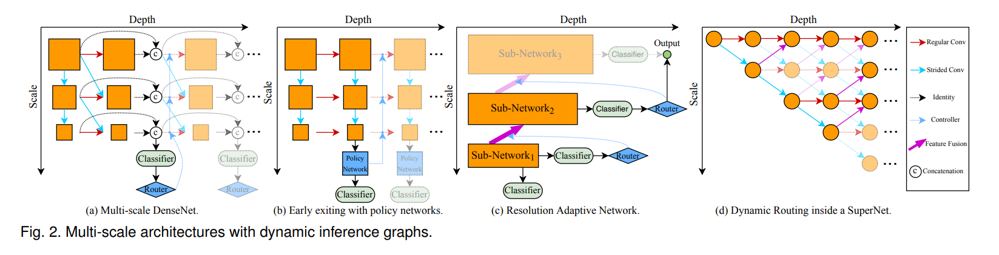

# Dynamic Neural Networks: A Survey

### 这篇笔记的写作者是[VisualDust](https://github.com/visualDust)。

这篇论文是一篇对动态神经网络的综述，原论文["Dynamic Neural Networks: A Survey"](http://arxiv.org/abs/2102.04906)主要讲了：

- 概念（Introduction）
- 常见的动态神经网络
  - Instance-wise Dynamic Networks
  - Spatial-wise Dynamic Networks
  - Temporal-wise Dynamic Network
- 推理和训练（Inference and Training）
- 常见应用和代表性工作（Applications）

这篇论文对近些年吸引了很多研究者的动态神经网络进行了较为系统的总结概括。

> Dynamic neural network is an emerging research topic in deep learning. Compared to static models which have fixed computational graphs and parameters at the inference stage, dynamic networks can adapt their structures or parameters to different inputs, leading to notable advantages in terms of accuracy, computational efficiency, adaptiveness, etc. In this survey, we comprehensively review this rapidly developing area by dividing dynamic networks into three main categories: 1) instance-wise dynamic models that process each instance with data-dependent architectures or parameters; 2) spatial-wise dynamic networks that conduct adaptive computation with respect to different spatial locations of image data and 3) temporal-wise dynamic models that perform adaptive inference along the temporal dimension for sequential data such as videos and texts. The important research problems of dynamic networks, e.g., architecture design, decision making scheme, optimization technique and applications, are reviewed systematically. Finally, we discuss the open problems in this field together with interesting future research directions.

动态神经网络近些年的相关研究逐渐变多，比起固定计算图的传统的静态神经网络，动态神经网络能够可以根据输入的具体数据调整它们的结构或是参数，同时在速度和精度方面占有优势。一种比喻是：“在输入较为简单时，动态神经网络可以很快；在输入较为复杂时，动态神经网络可以精度很高”。

这篇论文概括地介绍了动态神经网络是如何“动态”的，以及动态带来了怎样的优势。 

我看了这篇综述受益匪浅，如果有时间的话请阅读[原作](http://arxiv.org/abs/2102.04906)。本文只是对原作阅读的粗浅笔记。

---

## 介绍（Introduction）

神经网络随着硬件条件的发展逐渐追求更好的效果和更高的性能。作者将视觉领域的神经网络近十年的发展分为这样几个阶段：

1. 快速发展阶段（Fast developing stage），2012~2015

   神经网络的设计变得多样化，出现了包括AlexNet、VGG、GoogLeNet在内的一系列代表性网络结构。

2. 发展成熟阶段（Mature stage），2015~2017

   这个阶段出现了很多至今都起到了很重要的影响的或是依然被大家经常使用的网络结构，例如ResNet、DenseNet等

3. 繁荣发展阶段（Properous stage），2017~Now

   人们设计了很多多样化的效果优秀的神经网络，并且大量出现了很多新型的神经网络，例如轻量级网络CondenseNet、ShuffleNet，利用自动搜索技术设计的模型NASNet、DARTS，还有这篇论文想要介绍的动态神经网络MSDNet、Block-Drop、Glance and Focus等，以及突然就火起来的Transformer。

直到现在，CNN structure  has been never more varied。以CNN网络为例，CNN在ImageNet上的分类准确率正在逐渐提高，甚至达到超过人类的分类水平。随着模型的准确率逐渐提升，人们提出了这样的问题：

> 如何平衡网络的精度和网络计算开销之间的关系

上面这张图片来自一篇名为[Speed/accuracy trade-offs for modern convolutional object detectors](https://arxiv.org/abs/1611.10012)的论文，大致描述了一些知名网络结构的`开销-精度`图。这便是在神经网络成熟之后人们开始关注的问题。人们希望有更加靠近左上角的模型。

一个既成事实是，模型的精度往往和模型的宽度和深度相关，当希望达到更高的准确率时，往往会增加模型的深度和宽度，但是这往往会提高神经网络计算的开销，也就是说此时模型会走向模型的右上角。

以上面的图片为例，左图是一只的[coronaPolvo](https://github.com/coronaPolvo)，右图是一只[PommesPeter](https://github.com/pommespeter)。他们都是我的好朋友，但是我一瞬间即可认出左图，而认出右图则需要几秒钟。这是因为左图画面明亮，且coronaPolvo占据了画面的主体位置；而右侧的PommesPeter并没有占据画面的主体，并且被车的阴影遮挡，光照条件较差难易辨认。

有很多研究已经标明了人的大脑在处理信息时的处理过程会受到周围环境以及很多其他上下文的影响。**这便是动态神经网路的基本构想：对于简单的样本，可以轻易认出；对于复杂的样本，可以多花一点时间。或者说，人名为能发现传统CNN的一个缺陷**：

> Most convolutional neural networks recognize all instance with the same architecture.

所以动态神经网络的能力就是：

> Dynamic neural networks can adapt their architecture for different instances.

动态神经网络具有以下优势：

- 高效（Efficiency）
- 更强的表达能力（Representation power）
- 更强的适应性（Adaptiveness）
- 兼容性（Compatibility）
- 设计的简单性（Generality）
- 设计的可解释性（Interpretability）

下图是这篇论文的整体内容，涵盖非常的广，推荐阅读一下[原文](http://arxiv.org/abs/2102.04906)。

---

## 样本自适应的动态神经网络（Instance-wise dynamic networks）

为了在简单样本上获得更快的推理速度，以及在复杂样本上获得更好的精度，一个最简单并且天真的思路就是，导入多个网络模型，并且在输入较为复杂时使用更复杂的网络，输入简单时使用简单的网络。这个方法基本行不通，因为网络无法提前知道一个输入到底是复杂的还是简单的。

所以，我们需要研究样本自适应的动态神经网络

> Instance-wise dynamic networks can adapt their architectures or parameters to each instance.

对不同的输入样本，这种网络会动态调节自己的结构或参数。

样本自适应的动态网络分为：

- 动态结构（Dynamic architecture）
  - 动态深度（Dynamic Depth）
    - 早退机制（Early Existing）
    - 跳层机制（Layer Skipping）
  - 动态宽度（Dynamic Width）
    - 跳过神经元（Skip Neurons）
    - 跳过通道（Skip Channels）
    - 跳过分支（Skip Branches）
  - 动态路由（Dynamic Routing）
- 动态参数

上图（原论文Fig.2）：一些多尺度动态网络结构示意图。其中`(a)`为多尺度DenseNet，`(b)`为带有早退机制的网络，`c`为自适应输入分辨率的网络，`(d)`为在SuperNet中存在的动态路径。

---

### 动态深度（Dynamic Depth）

#### 早退机制（early escape）

简而言之，动态深度就是网络会根据某种机制判定样本是简单的还算复杂的，对于难一点的样本，网络可以将其一算到底，而对于简单一些的样本，网络计算到中间的时候就可以停止计算了。

有两种常见的实现方式：

- (a)串联多个模型（Cascading of DNNS，比较早期的工作）

  在这种方法中，一个网络包含了由浅到深的多个模型：输入通过某个模型后得到输出，经过训练得到的“决定函数”会根据输出的具体情况决定是将特征图直接放入线性分类器还是再次输入到下个模型中继续推理。

  这种方法有一个问题，很多情况下，特征并不能被复用，或者说不同模型并不能很好地“级联”在一起，例如上图中(a)，若$Model_1$是VGG，而$Model_2$是ResNet，那么很明显这样的设计会导$Model_1$的输出并不能能作为$Model_2$的输入，从而演化成花费两个网络的计算开销，导致额外的性能浪费。

-  (b)添加中间出口（Network with intermediate classifiers）

  如上图中(b)，这种方法往往通过在一个骨干网络的每个模块之后插入出口实现，即在每个模块的后方加入一个出口，通过设计不同的退出准则来决定模型每经过一个模块的计算之后是否已经不再需要后续网络了，从而实现早退。

然而，这种使用早退的方法并不是最优的。有研究标明，如果在模型中添加中间出口，往往会影响模型的分类性能。原因是CNN的更深层输出的feature map往往才具有更多的语义信息，提前退出往往会导致特征提取“并不到位”。

比较简单的一种解决方法是使用多尺度的、密集连接的网络架构：

在上图中，较低维度的特征通过`concat`等操作融合到深层的特征中参与分类，这样不同尺度的特征都能够参与分类。其是否退出的标准为某个分类器的置信度是否达到某个阈值。

例如，在上图中，一张猫的照片参与了分类，当网络在某个分类器上的输出（一般是`softmax`输出）的置信度达到一定值的时候，网络就可以退出了，后面的网络将不被执行。从而实现了动态减小网络的计算量。

还有许多具有早退机制的网络，如果我看到了会单独写一节来介绍。

#### 跨层连接（skip connections）

早退机制是通过在网络执行的某个阶段退出从而节省计算开销的，而跨层连接的动态神经网络则会执行完整个网络，只是在网络的中间层会出现跨层的连接方式。跨层连接一般被实现在一些具有类似于`skip connection`或是`residual connection`的网络结构中。

跨层连接的一种简单实现方法是在具有跨层连接的网络中加入`Gating module`。如上图，经过训练的`Gating module`如果输出为1，则不跳过这一层；

当`Gating module`的输出为0时，就跳过这一层的计算，即输入直接被当作输出。`Gating module`一般是包含一个被称为门控函数（Gating function）的计算单元。

还有一种实现跳层的方法：

如上图，输入在正式进入主干网络之前会先经过一个被称为`Policy Network`的网络，这个网络会决定对于当前输入应该跳过哪些层，并通知主干网络这样做。`Policy Network`的输出一般是一个向量，其中包含了哪些层应该被跳过的信息。

还有许多具有跳层机制的网络，如果我看到了会单独写一节来介绍。

### 动态宽度（Dynamic Width）

#### 动态通道数（Dynamic channel pruning in CNNs）

动态宽度的动态神经网络，顾名思义，这种网络会根据输入动态调整网络的宽度。一种比较简单的思路是，动态调整通道数量：

在上图中，也出现了一个被称为`Gating module`的模块，它根据输入的不同会向卷积层提供一个向量，该向量决定了卷积层跳过输出哪些通道。一种可能的方法是，该向量由0和1组成，卷积层将保留1代表的通道，而取消0代表的通道。

另一种可行的方法是使用多个不同宽度的网络对输入进行处理，当某个深度的网络的输出（例如`softmax`输出）达到某个阈值时，就不再加深网络了。

#### 专家子网络加权（Mixture of Experts，MOE）

这种方法是通过将很多不同的网络的结果进行动态加权来提升网络性能的一种方法。请注意，这种方法会加大计算量和参数量。

上图是两种可行的思路：

- (a)是一种“软加权”，对多个网络的输出进行动态加权，每个子网络都会被执行完，通过调节加权达到更好的性能。
- (b)是一种“硬加权”，通过一个`Gating Module`决定某个子网络是否参与决策。如果某个子网络不参与决策，则它根本不会被执行。

#### 动态全连接层大小（Dynamic width of fully-connected layers）

自如起名，动态修改全连接层的大小，不需要任何额外模块和设计。这里不做详细介绍。

---

### 动态路由（Dynamic Routing）

上面介绍的动态深度和动态宽度的方法广义上实际上都能视为某种简单的动态路由方法。这里的动态路由单独拿出来，指具有更加复杂的超网络结构的动态路由。

//todo 我还没写完