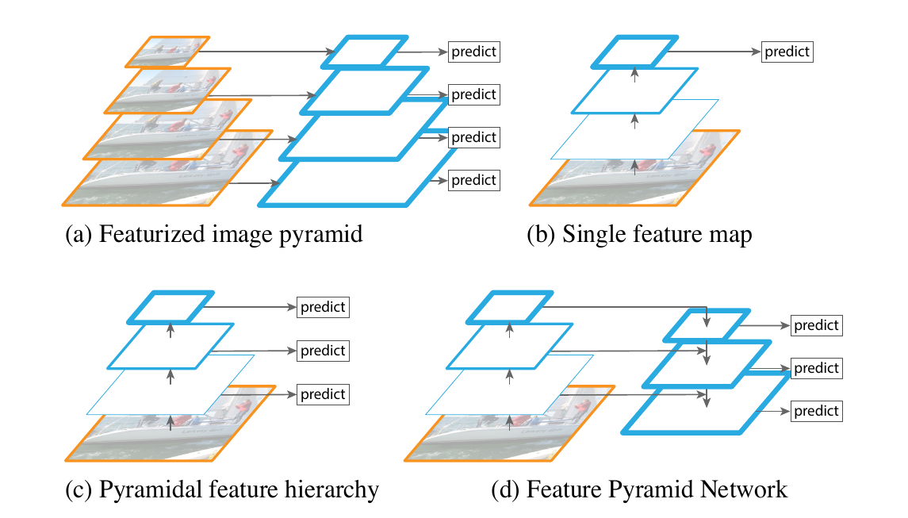
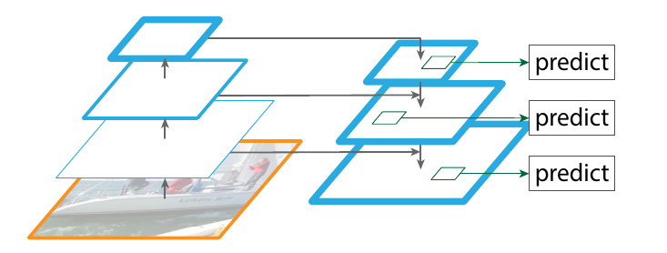
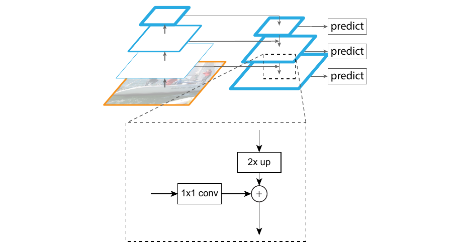

# Feature Pyramid Networks for Object Detection

### 这篇笔记的写作者是[VisualDust](https://github.com/visualDust)。

原论文[Feature Pyramid Networks for Object Detection](https://arxiv.org/abs/1612.03144)。

这篇论文就是大家熟知的FPN了。FPN是**比较早期的一份工作**（请注意，这篇论文只是多尺度特征融合的一种方式。不过这篇论文提出的比较早（CVPR2017），在当时看来是非常先进的），在当时具有很多亮点：FPN主要解决的是物体检测中的多尺度问题，通过简单的网络连接改变，在基本不增加原有模型计算量情况下，大幅度提升了小物体检测的性能。

## Abstract（摘要）

> Feature pyramids are a basic component in recognition systems for detecting objects at different scales. But recent deep learning object detectors have avoided pyramid representations, in part because they are compute and memory intensive. In this paper, we exploit the inherent multi-scale, pyramidal hierarchy of deep convolutional networks to construct feature pyramids with marginal extra cost. A top-down architecture with lateral connections is developed for building high-level semantic feature maps at all scales. This architecture, called a Feature Pyramid Network (FPN), shows significant improvement as a generic feature extractor in several applications. Using FPN in a basic Faster R-CNN system, our method achieves state-of-the-art single-model results on the COCO detection benchmark without bells and whistles, surpassing all existing single-model entries including those from the COCO 2016 challenge winners. In addition, our method can run at 5 FPS on a GPU and thus is a practical and accurate solution to multi-scale object detection. Code will be made publicly available.

这篇论文对以后的许多网络设计产生了较大的影响，推荐你阅读[原文](https://arxiv.org/abs/1612.03144)。这里只是对这篇论文的粗浅阅读笔记。

---

## 介绍（Introduction）

该论文提出，特征金字塔是识别系统中用于检测不同比例物体的基本组件，甚至号称手工特征设计时代的万金油：比如在OpenCV库的特征匹配Cascade分类器用于人脸识别中使用特征金字塔模型+AdaBoost提取不同尺度特征经行分类等。

原论文这样形容多尺度的好处：

> The principle advantage of featurizing each level of an image pyramid is that it produces a multi-scale feature representation in which all levels are semantically strong, including the high-resolution levels.

在进入深度卷积网络之后，如何在卷积神经网络中更好地利用多尺度称为了一项挑战。一方面，仅使用深度卷积网络进行检测会导致小目标的漏检；另一方面，在每层不同级别的特征图上进行预测产生了多余的性能消耗，并且效果并没有想象的那么好。这篇论文就是为了解决这个问题的。

---

## 相关工作（Related works）

- 手工设计的特征和早期神经网络（Hand-engineered features and early neural networks）
- 普通的深度卷积目标检测网络（Deep ConvNet object detectors）
- 融合了深度卷积网络的特征金字塔模型（Methods using multiple layers）

上图为原论文中出现的示意图。其中：

- (a)是手工设计特征描述时代的常见模型，即对不同尺寸的图片提取特征，以满足不同尺度目标的检测要求，提高模型性能。

- (b)是普通的深度卷积网络模式，通过下采样扩大感受野，提取语义信息。

- (c)是融合了深度卷积网络的特征金字塔模型。深度卷积网络在卷积过程中每层都会产生不同尺度的特征图，所以其本身就天然具有金字塔结构。截止到这篇论文的写作时间为止，有很多在COCO和ImageNet上表现优秀的网络都是pyramid representations的，即让不同层预测不同尺度的物体。但是其对小目标的检测效果仍然不够好，原因在于低尺度的特征图包含的语义信息还不够深刻（说俗话就是欠卷了），原文是这样说的：

  > This in-network feature hierarchy produces feature maps of different spatial resolutions, but introduces large semantic gaps caused by different depths. The high-resolution maps have low-level features that harm their representational capacity for object recognition.

  SSD就是第一批采用这种方法的深度卷积网络之一。不过SSD为了避免使用语义信息不足的特征图，SSD并没能很好地复用已有的特征图，这让它对小目标的检测效果仍然不够好。卷积神经网络的深度往往和每一步的卷积的步长参数是一个很矛盾的东西。展开来说，网络更深的时候，就不得不通过将步长改大以平衡更深的网络带来的参数量上涨问题。但同时这导致了另外一个问题，就是步长很大的时候，甚至可以大过输入图像中一些物体的大小，使得一些目标丢失。

- (d)是这篇论文要提出的FPN网络结构。该网络在设计时的一个目标就是避免(c)中出现的问题，让每一个尺度的特征图都会包含足够丰富的语义信息。

---

## 特征金字塔网络（Feature Pyramid Networks）

原论文这样描述这篇论文的目的：

> Our goal is to leverage a ConvNet’s pyramidal feature hierarchy, which has semantics from low to high levels, and build a feature pyramid with high-level semantics throughout.

也就是说，这篇论文的目的就是利用深度卷积网络天然存在的金字塔特征层次结构：该层次结构利用自底向上的逐层的卷积获得丰富的语义信息，并在整个过程中构建具有高层语义的特征金字塔。

这篇论文的网络结构设计主要包含了两个部分：

- 自底向上（Bottom-up pathway）
- 自顶向下（Top-down pathway and lateral connections）

在接下来的说明中，会经常使用`stage`的概念。在这里进行提前定义说明：在这篇论文中，网络中输出的feature map大小相同的层被称为是同个stage的。不同stage会产生不同大小的特征图，这篇论文为每个stage定义一个金字塔层级（pyramid level）。

例如上图是VGG-16的网络结构图，图中用紫色的文字标出了5个不同的stage。当然，不挨在一起但是输出特征图大小相同的层也是属于同一个stage的。

### 自底向上（Bottom-up pathway）

自底向上就是普通深度卷积网络前向传播的过程。对于提及的金字塔（pyramid）特征，这篇论文选择每个stage最后一层的输出作为一个特征图，这个选择听上去很合理，因为越上层（每个stage的最后一个层）的特征就包含更多的语义信息。

例如，在上图中，这篇论文的方法选择右侧的特征图输出作为一个stage的特征图输出而不是左侧的。

### 自顶向下（Top-down pathway and lateral connections）

自顶向下的结构在直观感受上是和深度卷积网络下采样的过程相反的：它将高层stage输出的空间信息很粗劣（毕竟之前一直在下采样...）但是语义信息很丰富的特征图进行不断上采样，上采样到和其对应的stage的上一个stage的特征图大小，再通过图中这种侧边的连接（lateral connections），使用低一级stage的特征图来增强它。

上图是论文中侧边连接（lateral connections）的方式。每个侧边连接将同个stage的自底向上的特征图和自顶向下的特征图相加。注意，该论文中特指了每两个stage之间的空间分辨率之差是2倍，也就是下采样率是2倍。所以上图的示意中靠近顶层的特征图经过2倍上采样后使用侧边连接和上一级特征图相加组成增强后的新特征；技术上，在侧边连接的过程中，这篇论文的方法使用$1\times 1$卷积的方式使需要相加的特征图通道数保持一致。

---

## 应用（Applications）

有空就写。

