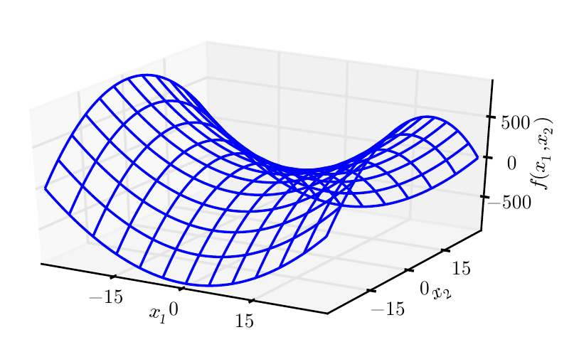
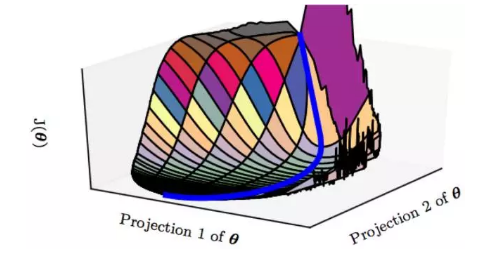

# 数值稳定性、模型初始化、鞍点收敛问题

理解了正向传播与反向传播以后，我们来讨论一下深度学习模型的数值稳定性问题以及模型参数的初始化方法。深度模型有关数值稳定性的典型问题是衰减（vanishing）和爆炸（explosion）。

## 衰减和爆炸

当神经网络的层数较多时，模型的数值稳定性容易变差。假设一个层数为$L$的多层感知机的第$l$层$\boldsymbol{H}^{(l)}$的权重参数为$\boldsymbol{W}^{(l)}$，输出层$\boldsymbol{H}^{(L)}$的权重参数为$\boldsymbol{W}^{(L)}$。为了便于讨论，不考虑偏差参数，且设所有隐藏层的激活函数为恒等映射（identity mapping）$\phi(x) = x$。给定输入$\boldsymbol{X}$，多层感知机的第$l$层的输出$\boldsymbol{H}^{(l)} = \boldsymbol{X} \boldsymbol{W}^{(1)} \boldsymbol{W}^{(2)} \ldots \boldsymbol{W}^{(l)}$。此时，如果层数$l$较大，$\boldsymbol{H}^{(l)}$的计算可能会出现衰减或爆炸。举个例子，假设输入和所有层的权重参数都是标量，如权重参数为0.2和5，多层感知机的第30层输出为输入$\boldsymbol{X}$分别与$0.2^{30} \approx 1 \times 10^{-21}$（衰减）和$5^{30} \approx 9 \times 10^{20}$（爆炸）的乘积。类似地，当层数较多时，梯度的计算也更容易出现衰减或爆炸。

随着内容的不断深入，我们会在后面的章节进一步介绍深度学习的数值稳定性问题以及解决方法。

## 随机初始化模型参数

在神经网络中，通常需要随机初始化模型参数。下面我们来解释这样做的原因。

回顾3.8节（多层感知机）图3.3描述的多层感知机。为了方便解释，假设输出层只保留一个输出单元$o_1$（删去$o_2$和$o_3$以及指向它们的箭头），且隐藏层使用相同的激活函数。如果将每个隐藏单元的参数都初始化为相等的值，那么在正向传播时每个隐藏单元将根据相同的输入计算出相同的值，并传递至输出层。在反向传播中，每个隐藏单元的参数梯度值相等。因此，这些参数在使用基于梯度的优化算法迭代后值依然相等。之后的迭代也是如此。在这种情况下，无论隐藏单元有多少，隐藏层本质上只有1个隐藏单元在发挥作用。因此，正如在前面的实验中所做的那样，我们通常将神经网络的模型参数，特别是权重参数，进行随机初始化。

### Tensorflow2.0的默认随机初始化

随机初始化模型参数的方法有很多。在3.3节（线性回归的简洁实现）中，我们使用`kernel_initializer=init.RandomNormal(stddev=0.01)`使模型`model`的权重参数采用正态分布的随机初始化方式。不过，Tensorflow中`initializers`的模块参数都采取了较为合理的初始化策略（不同类型的layer具体采样的哪一种初始化方法的可参考[源代码](https://github.com/tensorflow/tensorflow/blob/master/tensorflow/python/keras/layers)），因此一般不用我们考虑。

### Xavier随机初始化

还有一种比较常用的随机初始化方法叫作Xavier随机初始化[1]。
假设某全连接层的输入个数为$a$，输出个数为$b$，Xavier随机初始化将使该层中权重参数的每个元素都随机采样于均匀分布

$$U\left(-\sqrt{\frac{6}{a+b}}, \sqrt{\frac{6}{a+b}}\right).$$

它的设计主要考虑到，模型参数初始化后，每层输出的方差不该受该层输入个数影响，且每层梯度的方差也不该受该层输出个数影响。

## 模型是否收敛在鞍点

我们知道，在局部最优点附近，各个维度的导数都接近0，而我们训练模型最常用的梯度下降法又是基于导数与步长的乘积去更新模型参数的，因此一旦陷入了局部最优点，就很难直着跳出去。更何况梯度下降法的每一步对梯度正确的估计都在试图让模型到达局部最优点，因此势必要对梯度“估计错很多次”才可能侥幸离开。

上图：既有正曲率又有负曲率的鞍点。示例中的函数是$f (x) = x_1^2 - x_2^2$。函数沿$x_1$轴向上弯曲。$x_1$轴是 Hessian 的一个特征向量，并且具有正特征值。函数沿$x_2$​​轴向下弯曲。该方向对应于 Hessian 负特征值的特征向量。名称“鞍点”源自该处函数的鞍状形状。

**若某个一阶导数为0的点在至少一个方向上的二阶导数小于0，那它就是鞍点**。显然，这个特征同时符合局部最优点的描述，但鞍点并不是局部最优点。显然，只用一阶导数是难以区分最优点和鞍点的。不过我们可以使用二阶导数区分：**若某个一阶导数为0的点在至少一个方向上的二阶导数小于0，那它就是鞍点**。

由于我们并没有先验知识，我们无法估计曲面上一点二阶导数的准确值，因此按照最大熵原理，我们认为二阶导数大于和小于0的概率均为0.5。那么对于一个有n个参数的机器学习/深度学习模型，“loss曲面”即位于n+1维空间（loss值为纵轴，n个参数为n个横轴）。在这个空间里，如果我们通过梯度下降法一路下滑终于滑到了一个各方向导数均为0的点，那么它为局部最优点的概率即$0.5^n$​，为鞍点的概率为$1-0.5^n$​。显然，**当模型参数n较多时，某个点为鞍点的概率会远大于局部最优点**。

**也就是说，如果最后模型确实在梯度下降法的指引下收敛到了一个导数为0的点，那这个点几乎可以肯定就是一个鞍点。**

显然，站在马鞍中央的时候，虽然很难翻过两边的山坡，但是往前或者往后随便走一步就能摔下马鞍。我们默认使用的mini-batch梯度下降法本身就是有噪声的梯度估计，即使位于梯度为0的点，也经常在某个mini-batch下产生一个有偏估计，导致往前或者往后挪了一步摔下马鞍，**也就是mini-batch的梯度下降法使得模型很容易逃离特征空间中的鞍点。**

虽然高维空间中的鞍点数量远远大于最优点，但是鞍点的数量在整个空间中又是微不足道的：按前面的假设，假设在某个维度上随机一跳有10%的概率踩到导数为0的点，那么我们在101维的空间中的一步恰好踩到这个点上的概率为$10^{-100}$，也就是说在101维空间里随机乱跳的时候，有$10^{-100}$的可能性踩到鞍点身上。因此，即使有难以逃离的鞍点，那么被我们正好踩到的概率也是非常小的。

所以更令人信服的是，在高维空间里（深度学习问题上）真正可怕的不是局部最优也不是鞍点问题，而是一些特殊地形。比如大面积的平坦区域：

在平坦区域，虽然导数不为0但是却不大。虽然是在不断下降但是路程却非常长。对于优化算法来说，它需要走很多很多步才有可能走过这一片平坦区域。甚至在这段地形的二阶导数过于特殊的情况下，一阶优化算法走无穷多步也走不出去。

所以相比于栽到最优点和鞍点上，优化算法更有可能载到这种类似平坦区的地形中（如果这个平坦区又是“高原地带”，即loss值很高的地带，那么恭喜你悲剧了）。更糟糕的是，由于高维地形难以可视化，还有很多更复杂的未知地形会导致假收敛，一旦陷入到这些危险地形中，几乎是无解的。

**结论是：在深度学习中，与其担忧模型陷入局部最优点怎么跳出来，更不如去好好考虑**：

1. 如何去设计一个尽量没有“平坦区”等危险地形的loss空间，即着手于loss函数的设计以及深度学习模型的设计；
2. 尽量让模型的初始化点远离空间中的危险地带，让最优化游戏开始于简单模式，即着手于模型参数的初始化策略；
3. 让最优化过程更智能一点，该加速冲时加速冲，该大胆跳跃时就大胆跳，该慢慢踱步时慢慢走，对危险地形有一定的判断力，如梯度截断策略；
4. 开外挂，本来下一步要走向死亡的，结果被外挂给拽回了安全区，如batch normalization策略等。

## 小结

* 深度模型有关数值稳定性的典型问题是衰减和爆炸。当神经网络的层数较多时，模型的数值稳定性容易变差。
* 我们通常需要随机初始化神经网络的模型参数，如权重参数。
* 不用担心模型会陷入局部最优点跳不出来，反正担心也没用。
